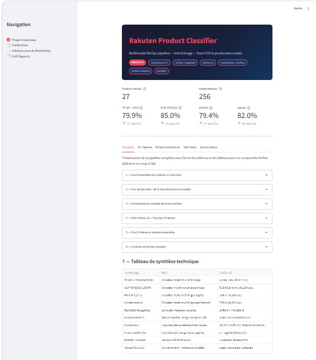
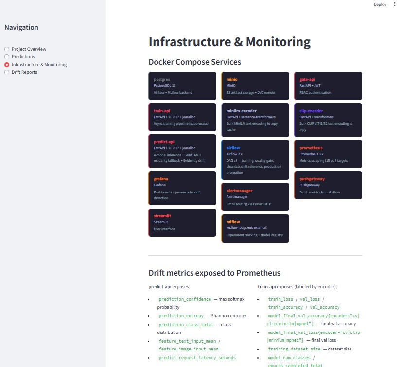
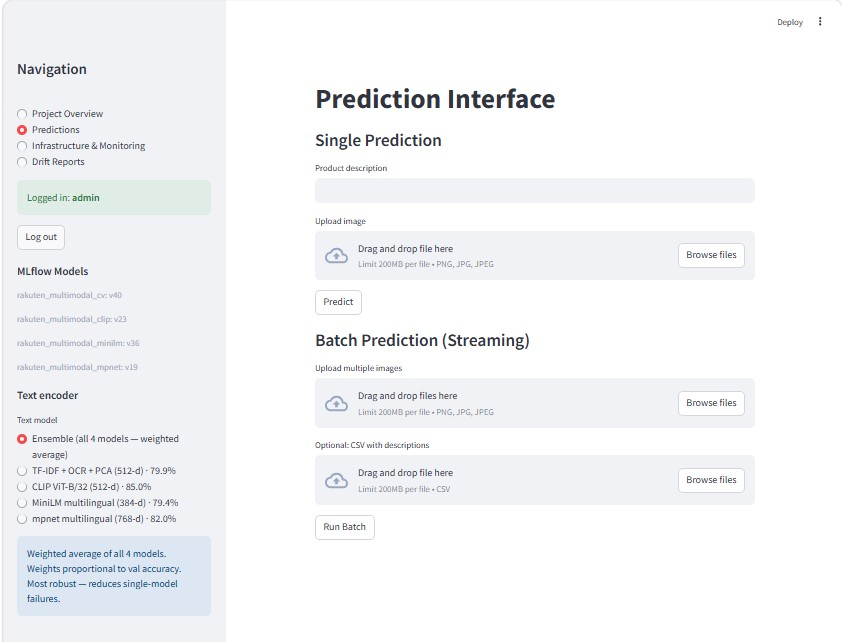
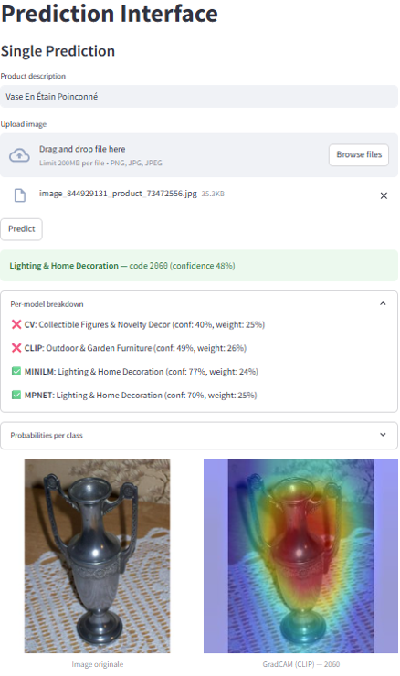
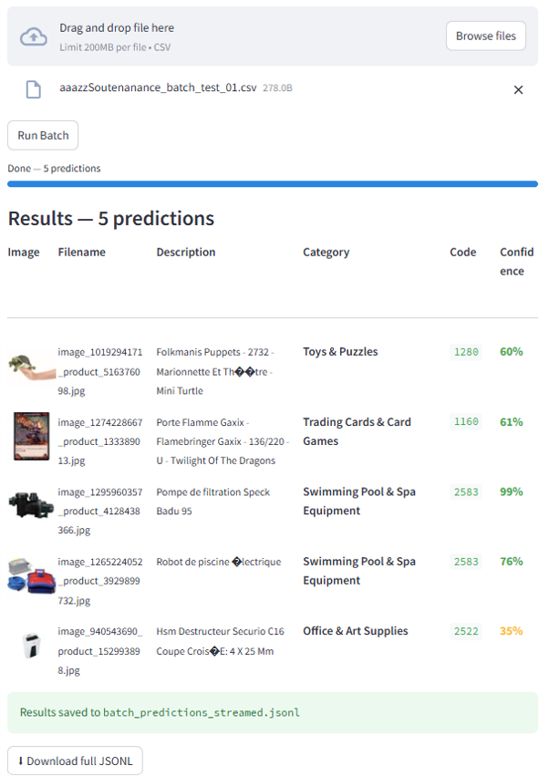
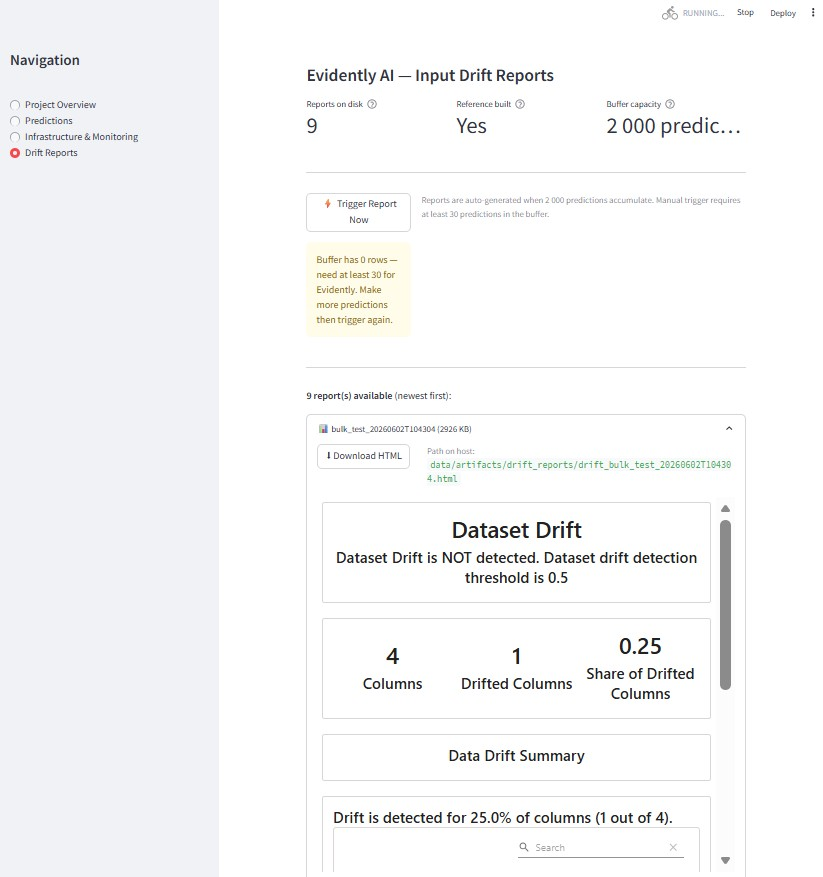
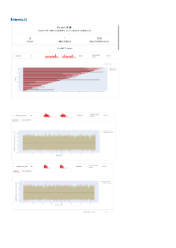
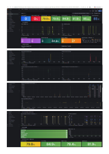

# Rakuten MLOps Platform

[](https://github.com/zz75da/rakuten_z/actions/workflows/dvc-ci.yml)
[](LICENSE)

**Author:** [zz75da](https://github.com/zz75da)

End-to-end MLOps platform for **multimodal product classification** (text + image → 27 Rakuten categories, ~85k products).  
Built with FastAPI microservices, Apache Airflow DAG v7, MLflow / DagsHub, and a full Prometheus / Grafana monitoring stack.

**Current best accuracy:** CLIP 84.9% · mpnet 81.9% · CV 80.2% · MiniLM 79.7% · Ensemble (weighted avg) robust to single-model failures.

---

## Table of Contents

- [Streamlit Interface](#streamlit-interface)
- [Model Overview](#model-overview)
- [Architecture](#architecture)
- [Services](#services)
- [Quick Start](#quick-start)
- [Service Endpoints](#service-endpoints)
- [Monitoring & Drift Detection](#monitoring--drift-detection)
- [Data & Experiment Tracking](#data--experiment-tracking)
- [Test Suite](#test-suite)
- [Repository Structure](#repository-structure)
- [Environment Variables](#environment-variables)
- [Scalability & Kubernetes (proof of concept)](#scalability--kubernetes-proof-of-concept)
- [Troubleshooting](#troubleshooting)

---

## Streamlit Interface

<table>
<tr>
<td width="50%">

**Project Overview**
Live-updating summary — model accuracies per encoder, docker-compose service map, and a French-language walkthrough of the full pipeline.



</td>
<td width="50%">

**Infrastructure & Monitoring**
14 docker-compose services at a glance, plus the Prometheus metric names exposed by `predict-api` and `train-api`.



</td>
</tr>
<tr>
<td width="50%">

**Predictions — Single & Batch**
Upload a description + image for single prediction, or a CSV + image folder for streamed batch inference, with a choice of the 4 encoders or the weighted ensemble.



</td>
<td width="50%">

**Single Prediction — Per-Model Breakdown & GradCAM**
Ensemble result with each encoder's individual vote/confidence/weight, plus a CLIP GradCAM heatmap over the uploaded image.



</td>
</tr>
<tr>
<td width="50%">

**Batch Prediction Results**
Streamed predictions over a CSV, with per-row thumbnail, predicted category/code, and confidence — exportable as JSONL.



</td>
<td width="50%">

**Drift Reports**
Evidently AI report browser — buffer status, reference dataset state, and on-demand report generation from Streamlit.



</td>
</tr>
<tr>
<td width="50%">

**Evidently Drift Report Detail**
Dataset drift summary and per-column distributions from a generated Evidently HTML report.



</td>
<td width="50%">

**Grafana Dashboard**
Per-encoder validation accuracy, prediction confidence/entropy, and service health — auto-provisioned alongside the stack.



</td>
</tr>
</table>

---

## Model Overview

Four text encoders with a shared late-fusion architecture. All encoders are served simultaneously by predict-api.

### Late Fusion Architecture (all encoders)

```
Text branch:   text features ──► Dense(HIDDEN_1) ──► LayerNorm ──► Dropout ──► Dense(27, logits)
                                                                                        │
Image branch:  ResNet50(2048) ──► PCA(256) ──► Dense(256) ──► LayerNorm ──► Dropout ──► Dense(27, logits)
                                                                                        │
Fusion:        α = Dense(1, sigmoid)(mean(text_logits) ⊕ mean(image_logits))
               output = α · softmax(text_logits) + (1−α) · softmax(image_logits)
```

**Training:** Focal loss γ∈{1.5,2.0,2.5} per encoder · Macro F1 early stopping · Stratified 80/20 split · Class weights balanced

### Encoder A — TF-IDF + OCR (CV)

```
designation + description + Tesseract OCR ──► SpaCy lemmatise ──► TfidfVectorizer(10k, sublinear_tf) ──► PCA(512)
```
Registered as **`rakuten_multimodal_cv`** · focal γ=2.5 · best val_acc 0.8013

### Encoder B — CLIP ViT-B/32

```
Text ──► laion/CLIP-ViT-B-32-laion2B-s34B-b79K (raw embeddings, 512-d)
```
Registered as **`rakuten_multimodal_clip`** · focal γ=1.5 · best val_acc 0.8487 (highest single model)

### Encoder C — MiniLM (multilingual)

```
Text ──► paraphrase-multilingual-MiniLM-L12-v2 (384-d)
```
Registered as **`rakuten_multimodal_minilm`** · focal γ=2.0 · best val_acc 0.7956

### Encoder D — mpnet (multilingual)

```
Text ──► paraphrase-multilingual-mpnet-base-v2 (768-d)
```
Registered as **`rakuten_multimodal_mpnet`** · focal γ=2.0 · best val_acc 0.8194

### Ensemble

`POST /predict-ensemble` averages 27-class probability vectors from all 4 encoders weighted by their recorded val_accuracy. Overrides single-model failures (e.g. CLIP's English-only text encoder on French products).

---

## Architecture

```
┌─────────────┐   JWT     ┌─────────────┐
│  Streamlit  │◄─────────►│  gate-api   │  Auth, RBAC admin/user
│    :8501    │           │    :5000    │
└──────┬──────┘           └─────────────┘
       │ Bearer token
       ▼
┌────────────────┐  POST /train   ┌────────────────────────────────────────────────┐
│   Airflow      │───────────────►│  train-api  :5002                              │
│    :8080       │◄─ poll status  │  ├── run_full_pipeline.py (subprocess)         │
│  DAG v7        │                │  │   ├── TF-IDF+OCR / PCA (versioned cache)    │
│  quality gate  │                │  │   └── trainer (late fusion, focal loss)     │
│  cleanlab      │                │  ├── POST /quality-gate  (pytest floors)       │
│  drift ref     │                │  ├── POST /cleanlab      (confident learning)  │
└────────────────┘                │  └── POST /drift-rebuild-reference             │
       │                          └───────────────┬────────────────────────────────┘
       ├─ also: POST /login {"admin","<GATE_API_ADMIN_PASSWORD>"} ──► gate-api :5000
       │        (get_auth_token / _fresh_token — Airflow always authenticates
       │         itself as the hardcoded "admin" user, independent of whichever
       │         user is logged into Streamlit; the returned Bearer token is
       │         cached in XCom for every task in the DAG run)
       │
       ├── POST /encode ──────►  clip-encoder :5007  (CLIP ViT-B/32)
       │                         minilm-encoder :5004  (MiniLM + mpnet)
       │                                       │
       │                                       │ POST /reload-artifacts
       │                                       │ (sent by train-api's
       │                                       │  run_full_pipeline.py once
       │                                       │  training finishes — not
       │                                       │  by the encoders themselves)
       │                                       ▼
       │                         ┌──────────────────────────────┐
       │                         │  predict-api  :5003          │
       │                         │  model_cv · clip · minilm    │
       │                         │  · mpnet (late fusion)        │
       │                         │  /predict-ensemble            │
       │                         │  /gradcam · /drift-*          │
       │                         │  Evidently AI drift buffer    │
       │                         └───────────────┬──────────────┘
       │                                         │
       └──────────────────────────────────────── ▼ ──────────────────────────────────
┌──────────────────────────────────────────────────────────────────────────┐
│  Prometheus (:9090)  ◄── scrapes 8 targets (5 FastAPI apps + infra)      │
│  Grafana    (:3000)  ──► drift dashboard, val_acc × 4 encoders, latency  │
│  Alertmanager(:9093) ──► confidence / accuracy / UP/DOWN / memory alerts │
└──────────────────────────────────────────────────────────────────────────┘
```

> Ports shown above are the **internal** container-network addresses used for service-to-service calls (e.g. `http://gate-api:5000`, `http://clip-encoder:5007`, `http://minilm-encoder:5004`). Several services are remapped to different **external** host ports — see [Services](#services) (gate-api → `5004`, minilm-encoder → `5005`, clip-encoder → `5006`).

---

## Services

| Service | Port | Role |
|---------|------|------|
| **gate-api** | 5004 (ext) | JWT auth (`/login`, `/validate-token`) |
| **train-api** | 5002 | Async training · quality gate · cleanlab · drift reference |
| **predict-api** | 5003 | 4-model inference · ensemble · GradCAM · modality fallback · Evidently drift |
| **minilm-encoder** | 5005 | Bulk MiniLM + mpnet sentence encoding → .npy caches |
| **clip-encoder** | 5006 | Bulk CLIP ViT-B/32 text encoding → .npy cache |
| **airflow** | 8080 | DAG v7: CV→CLIP→MiniLM→mpnet + quality gate + cleanlab + drift reference |
| **streamlit** | 8501 | UI: predictions (single + batch) · drift reports · training curves |
| **mlflow** | — | DagsHub-hosted experiment tracking + model registry (4 models) |
| **prometheus** | 9090 | Metrics scraping (15s interval, 8 targets) |
| **grafana** | 3000 | Dashboards + drift detection |
| **alertmanager** | 9093 | Alert routing |
| **postgres** | — | Airflow + MLflow backend |
| **minio** | 9002 | Local S3-compatible storage |
| **pushgateway** | 9091 | Batch metrics from Airflow |

---

## Quick Start

### Prerequisites

- Docker ≥ 24 and Docker Compose v2
- ~20 GB free disk · ~8 GB RAM minimum

### 1 — Clone and configure

```bash
git clone https://github.com/zz75da/rakuten_z.git
cd rakuten_z
cp .env.template .env       # fill in DAGSHUB_USER, DAGSHUB_TOKEN
```

### 2 — Pull DVC-tracked data and models

```bash
pip install "dvc[s3]"
dvc pull                    # downloads datasets + artifacts from DagsHub S3
```

### 3 — Start the stack

```bash
docker compose build train-api
docker compose build predict-api
docker compose up -d
```

### 4 — Verify services

```bash
docker compose ps
curl http://localhost:5002/health   # train-api
curl http://localhost:5003/health   # predict-api
curl http://localhost:5004/health   # gate-api (external port)
```

### 5 — Trigger a training run

Open `http://localhost:8080`, enable **`rakuten_multimodal_pipeline_v7`** and trigger manually.  
DAG runs all 4 encoders sequentially with cached feature reuse (~3h with warm caches).

---

## Service Endpoints

### gate-api — Authentication

```
POST /login              {"username": "admin", "password": "<GATE_API_ADMIN_PASSWORD>"}  → {"token": "..."}
POST /validate-token     Authorization: Bearer <token>
GET  /health
```

### train-api — Training + Audit

```
POST /train              {"epochs":60, "batch_size":128, "text_encoder":"countvectorizer|clip|minilm|mpnet",
                          "use_cache":true, "use_dev_images":false}
                         → 202 {"job_id":"...", "status":"running"}  |  409 if busy
GET  /train/status/{id}  → {"status":"success|running|failed", "step":"...", "final_metrics":{...}}
POST /quality-gate       Runs pytest quality assertions — returns pass/fail + output
POST /cleanlab           {"encoder": "clip|countvectorizer|minilm|mpnet"}  (default: clip — best accuracy)
                         Confident learning label audit via SGDClassifier cross-val → cleanlab_report_<encoder>.csv
POST /drift-rebuild-reference  Builds 5k stratified reference for Evidently
GET  /health
GET  /metrics
```

### predict-api — Inference

```
POST /predict-text        {"description":"...", "model":"cv|clip|minilm|mpnet"}
POST /predict-image       {"image_base64":"<base64>"}
POST /predict-multimodal  {"description":"...", "image_base64":"...", "model":"cv|clip|minilm|mpnet"}
                          CV encoder: OCR runs on image at inference time (Tesseract)
                          Returns mode: multimodal | text_only_fallback | image_only_fallback
POST /predict-ensemble    {"description":"...", "image_base64":"..."}
                          Weighted average of all 4 models + per-model breakdown
POST /gradcam             {"image_base64":"...", "model":"clip", "target_class":null}
                          Returns heatmap as base64 JPEG
POST /drift-trigger-report  Force Evidently report from current buffer (admin)
GET  /drift-status        Buffer size, reports on disk, reference status
POST /reload-artifacts    Reload all models from disk (called after training)
GET  /health
GET  /metrics
```

Each prediction returns:
```json
{
  "pred_class": 10, "label": "10", "category": "Books",
  "probs": [[...27 values...]], "mode": "multimodal", "encoder": "clip"
}
```

Ensemble additionally returns:
```json
{
  "breakdown": {
    "cv":     {"category": "Books", "confidence": 0.56, "weight": 0.24},
    "clip":   {"category": "Toys",  "confidence": 0.32, "weight": 0.26},
    "minilm": {"category": "Books", "confidence": 0.81, "weight": 0.24},
    "mpnet":  {"category": "Books", "confidence": 0.71, "weight": 0.25}
  }
}
```

---

## Monitoring & Drift Detection

Grafana auto-provisioned at `http://localhost:3000`.

### Prometheus metrics

| Metric | Description |
|--------|-------------|
| `model_final_val_accuracy{encoder="cv\|clip\|minilm\|mpnet"}` | Val accuracy after training |
| `model_final_val_macro_f1{encoder="cv\|clip\|minilm\|mpnet"}` | Macro-averaged F1 across all 27 classes after training — penalises minority-class failures equally regardless of class size |
| `model_final_val_top3_accuracy{encoder="cv\|clip\|minilm\|mpnet"}` | Fraction of samples where the true class appears in the model's top-3 predictions — useful for ranking/re-ranking use cases |
| `prediction_confidence` | Max softmax probability per request |
| `prediction_entropy` | Shannon entropy (high = uncertain = possible drift) |
| `prediction_class_total` | Predictions per class (distribution drift) |
| `predict_request_latency_seconds` | P95 latency histogram |

### Evidently drift reports

Predict-api buffers up to 2000 multimodal predictions then auto-generates an Evidently HTML report.  
Reports are saved to `data/artifacts/drift_reports/` (max 10 kept).  
View and download reports from the **Drift Reports** page in Streamlit.

### Alert thresholds

20 rules total in `monitoring/alert-rules.yml`, grouped below.

**Service health** (fires after the listed duration of `up == 0` / heartbeat loss)

| Alert | Condition |
|-------|-----------|
| TrainAPIDown / PredictAPIDown / MiniLMEncoderDown / CLIPEncoderDown | service down ≥ 3 min |
| GateAPIDown / PostgresqlDown | service down ≥ 2 min |
| AirflowSchedulerDown | scheduler heartbeat stalled ≥ 5 min |
| AirflowDagFailed | a DAG run reports failure ≥ 2 min |

**Model quality** (`model_final_val_accuracy{encoder=...}` after each training run)

| Alert | Threshold |
|-------|-----------|
| CVModelValAccuracyLow | < 0.72 |
| CLIPModelValAccuracyLow | < 0.80 |
| MiniLMModelValAccuracyLow | < 0.70 |
| mpnetModelValAccuracyLow | < 0.72 |

**Prediction / drift**

| Alert | Threshold |
|-------|-----------|
| PredictionConfidenceDrift | P50 confidence < 0.40 (15 min window) |
| PredictionEntropyHigh | P90 entropy > 2.5 (15 min window) |
| ClassDistributionSkewed | one predicted class > 80% of traffic (30 min window, ≥ 20 min) |
| HighPredictionErrorRate | 5xx ratio > 10% of requests (5 min window) |
| PredictionLatencyHigh | P95 latency > 5s |

**Resources**

| Alert | Threshold |
|-------|-----------|
| DiskSpaceLow | root filesystem < 10% free |
| HighMemoryUsage | memory used > 90% (10 min) |
| HighCPUUsage | CPU busy > 80% (10 min) |

---

## Data & Experiment Tracking

| Resource | URL |
|----------|-----|
| Code | https://github.com/zz75da/rakuten_z |
| DagsHub (data + MLflow) | https://dagshub.com/zz75da/rakuten_z |
| MLflow experiments | https://dagshub.com/zz75da/rakuten_z/experiments |
| Model Registry | https://dagshub.com/zz75da/rakuten_z/models |

### MLflow — what each run logs

**Parameters:** `text_encoder` · `input_dim` · `focal_gamma` · `use_late_fusion` · `use_layer_norm` · `pca_components` · `learning_rate` · `hidden_1/2` · `dropout_1/2` · `l2_reg` · `early_stopping_monitor` · `dataset_rows`

**Metrics per epoch:** `train_loss` · `val_loss` · `train_accuracy` · `val_accuracy` · `val_macro_f1` · `val_top3_accuracy`

**Final metrics:** `final_val_accuracy` · `final_val_macro_f1` · `final_val_top3_accuracy`

### MLflow Model Registry (4 models)

| Model | Encoder | Best val_acc |
|-------|---------|-------------|
| `rakuten_multimodal_cv` | TF-IDF + OCR | 0.8013 |
| `rakuten_multimodal_clip` | CLIP ViT-B/32 | 0.8487 |
| `rakuten_multimodal_minilm` | MiniLM-L12-v2 | 0.7956 |
| `rakuten_multimodal_mpnet` | mpnet-base-v2 | 0.8194 |

### DVC pipeline stages

`preprocess_text_cv` → `preprocess_text_clip` → `preprocess_text_minilm` → `preprocess_text_mpnet` → `preprocess_image` → `reduce_features_{cv|clip|minilm|mpnet}` → `train_{cv|clip|minilm|mpnet}` → `predict`

---

## Test Suite

```bash
# Unit tests (inside train-api container or CI)
pytest tests/unit/ train-api/tests/ -v

# Integration tests
pytest tests/integration/ -v -m integration

# Model quality gate (inside train-api container)
pytest /app/tests/test_model_quality.py -v
```

| File | Scope | What it tests |
|------|-------|---------------|
| `tests/unit/test_gate_api.py` | Unit | Login, JWT claims, token validation |
| `tests/unit/test_predict_api.py` | Unit | All predict endpoints, 4-model globals, drift, reload |
| `tests/unit/test_train_api.py` | Unit | `/train`, RBAC, 409 guard, job registry |
| `tests/unit/test_artifacts.py` | Unit | `save_artifacts()` — encoder-specific file sets, no cross-corruption |
| `tests/unit/test_models.py` | Unit | Late fusion architecture for all 4 input dims |
| `tests/unit/test_pca_reducer.py` | Unit | PCA shapes, versioned filenames, encoder pass-through |
| `tests/unit/test_preprocess_text.py` | Unit | TF-IDF vectorizer, OCR path, fit_only mode |
| `tests/unit/test_preprocess_image.py` | Unit | ResNet50 output shape |
| `tests/integration/test_api_integration.py` | Integration | JWT → validate cross-service flow |
| `tests/integration/test_workflow.py` | Integration | Full async training job lifecycle |
| `train-api/tests/test_model_quality.py` | Quality gate | Accuracy floors, macro F1 floor, no class collapse, overfit gap ≤ 0.20 |

---

## Repository Structure

```
rakuten_mlops_services/
├── airflow/
│   └── dags/train_dag_v6.py        # DAG v7: 4 encoders + quality gate + cleanlab + drift reference
├── gate-api/app.py                  # JWT auth
├── train-api/
│   ├── app.py                       # /train · /quality-gate · /cleanlab · /drift-rebuild-reference
│   ├── services/
│   │   ├── preprocess_text.py       # TF-IDF + SpaCy + real-time OCR merge (fit_only recovery)
│   │   ├── run_ocr_extraction.py    # One-shot OCR over image_train/ → ocr_text.csv
│   │   ├── pca_reducer.py           # IncrementalPCA — versioned output (pca_image_{n}.pkl)
│   │   ├── run_full_pipeline.py     # Full training subprocess (TF isolated, PCA versioned cache)
│   │   ├── trainer.py               # Late fusion model, focal loss, macro F1 callback, MLflow
│   │   ├── artifacts.py             # save_artifacts() — encoder-specific, no cross-corruption
│   │   └── run_cleanlab_audit.py    # Confident learning via SGDClassifier cross-val
│   └── tests/test_model_quality.py  # Pytest quality gate (accuracy/F1/overfit floors)
├── clip-encoder/app.py              # Bulk CLIP text encoding → text_features_clip.npy
├── minilm-encoder/app.py            # Bulk MiniLM + mpnet encoding → text_features_{minilm|mpnet}.npy
├── predict-api/
│   ├── app.py                       # 4-model inference · ensemble · GradCAM · OCR · Evidently drift
│   └── services/drift_monitor.py    # Evidently buffer (2000 cap) + HTML report rotation (10 max)
├── streamlit/app_streamlit.py       # UI: single/batch predictions · drift reports page · training curves
├── monitoring/
│   ├── prometheus.yml               # 8 scrape targets
│   ├── alert-rules.yml              # 4 encoder accuracy + latency + drift + resource alerts
│   └── grafana_dashboards/rakuten_drift_dashboard.json
├── tests/                           # unit + integration test suites
├── .github/workflows/dvc-ci.yml     # CI: tests + DVC remote sync (main + experiment/* branches)
├── dvc.yaml                         # Pipeline definition (versioned PCA outputs)
├── docker-compose.yml               # 14 services, subnet 172.20.0.0/16
└── params.yaml                      # All tunable hyperparameters (focal_gamma, use_late_fusion, etc.)
```

---

## Environment Variables

Copy `.env.template` to `.env`:

| Variable | Description |
|----------|-------------|
| `DAGSHUB_USER` | DagsHub username (DVC remote S3 + MLflow auth) |
| `DAGSHUB_TOKEN` | DagsHub access token |
| `MLFLOW_TRACKING_URI` | `https://dagshub.com/<user>/rakuten_z.mlflow` |
| `MLFLOW_S3_ENDPOINT_URL` | `https://dagshub.com` |
| `MLFLOW_EXPERIMENT_NAME` | `rakuten_z` |
| `MLFLOW_MODEL_NAME` | `rakuten_multimodal` (suffixed `_cv`, `_clip`, `_minilm`, `_mpnet`) |
| `ARTIFACTS_PATH` | `/app/data/artifacts` (predict-api) |
| `GATE_API_URL` | `http://gate-api:5000` |
| `PREDICT_API_URL` | `http://predict-api:5003` |
| `JWT_SECRET_KEY` | Secret for signing JWT tokens (gate-api + all services) |
| `GATE_API_ADMIN_PASSWORD` | Password for the `admin` user in gate-api |
| `GATE_API_USER_PASSWORD` | Password for the `user` role in gate-api |
| `LD_PRELOAD` | jemalloc, to curb glibc malloc fragmentation on long training/inference runs — train-api: `/usr/lib/x86_64-linux-gnu/libjemalloc.so.2`, predict-api: `/usr/local/lib/libjemalloc.so.2` |

---

## Scalability & Kubernetes (proof of concept)

The docker-compose stack runs as single-instance services. To validate that
`predict-api` (the most request-heavy service) can scale horizontally, the
[`k8s/`](k8s/) directory provides a Deployment + Service + HPA, tested on
Docker Desktop's local Kubernetes cluster:

- **Deployment**: reuses the existing `rakuten_mlops_services-predict-api:latest`
  image, resource requests/limits (2Gi/250m → 4Gi/1.5 CPU), startup/readiness/
  liveness probes on `/health`
- **HPA**: CPU-based, 1-2 replicas, 70% target (requires `metrics-server`)
- **Validated locally**: both replicas reach `1/1 Ready` with all 4 models
  (CV/CLIP/MiniLM/mpnet) loaded, `/health` responds via the ClusterIP service,
  and the HPA correctly reports `cpu: 1%/70%` and rescales the Deployment
  (`SuccessfulRescale` events observed for both scale-up and scale-down)

This is a local PoC: it uses `hostPath` volumes for `params.yaml`,
`data/artifacts` and `data/hf_cache`, and the local Docker image cache
(no registry push). A production setup would replace these with PVCs /
an init container pulling artifacts from MLflow, and push the image to a
registry. See [`k8s/README.md`](k8s/README.md) for deploy/teardown commands.

---

## Troubleshooting

### Services won't start

```bash
docker compose ps                          # check which containers exited
docker compose logs <service> --tail 50   # check logs
```

### Airflow → Postgres connection

```bash
docker exec airflow curl -s http://localhost:8080/health
docker exec airflow python -c "from airflow.models import DagRun; print('DB OK')"
```

### Train-api environment variables

```bash
docker exec train-api bash -c 'echo $MLFLOW_TRACKING_URI && echo $DAGSHUB_USER'
```

### MLflow can't reach DagsHub

- Verify `DAGSHUB_USER` and `DAGSHUB_TOKEN` in `.env`
- Check connectivity: `docker exec train-api curl -s https://dagshub.com`
- Confirm token has write access to the repository

### Models not loading in predict-api

```bash
docker logs predict-api | grep -E "✓|⚠"    # check which models loaded
curl http://localhost:5003/health            # confirm healthy
```

If models fail to load after a training run:
```bash
curl -X POST http://localhost:5003/reload-artifacts \
  -H "Authorization: Bearer <token>"
```

### DVC out of sync

```bash
dvc status --cloud    # check which files need pushing
dvc push              # upload missing files to DagsHub S3
```

### Quality gate fails after training

```bash
docker exec train-api pytest /app/tests/test_model_quality.py -v
```
Check that all history files (`train_history*.json`) exist in `/app/data/artifacts/`.

---

## Author & License

**Author:** [zz75da](https://github.com/zz75da)

Licensed under the [MIT License](LICENSE) — Copyright © 2026 zz75da.
